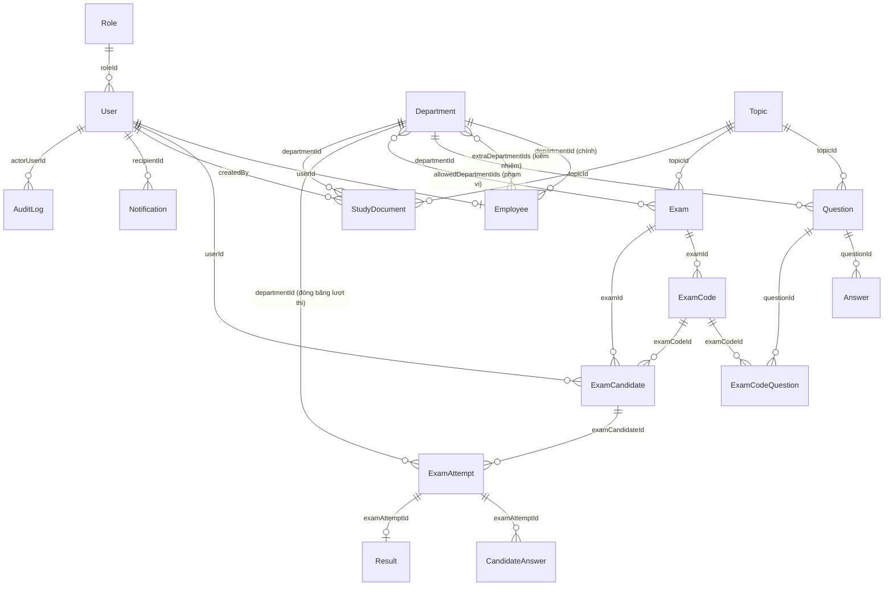

# Mô hình cơ sở dữ liệu (Mongoose Schema)

Hệ thống Z176 sử dụng MongoDB làm cơ sở dữ liệu chính. Mối quan hệ giữa các collection được quản lý chặt chẽ thông qua Mongoose ODM để phục vụ các nghiệp vụ sinh đề thi ngẫu nhiên, phân quyền 4 vai trò, cơ chế kiêm nhiệm, và giám sát realtime.

---

## 1. Sơ đồ quan hệ thực thể (ERD)

---

## 2. Danh sách các Collections

| Tên Model | Bộ sưu tập (Collection) | Vai trò nghiệp vụ |
| :--- | :--- | :--- |
| `Role` | `roles` | Lưu trữ 4 quyền hạn nghiệp vụ cốt lõi: `admin`, `examiner`, `leader`, `candidate`. |
| `User` | `users` | Thông tin tài khoản đăng nhập (`username`, `passwordHash`, trạng thái khóa `isActive`, `lockedAt` theo dõi mốc khóa để purge sau 6 tháng, `tokenVersion` quản lý đơn phiên đa thiết bị, `mustChangePassword`, `failedLoginAttempts`, `lockUntil`). |
| `Employee` | `employees` | Thông tin hồ sơ nhân viên, liên kết 1-1 với `User`. Có `departmentId` (phòng ban chính) và `extraDepartmentIds` (mảng ObjectId phòng ban kiêm nhiệm). |
| `Department` | `departments` | Danh mục phòng ban/phân xưởng trong nhà máy (`name`, `code`, `slug`, `isActive`). Dùng phân bổ câu hỏi riêng, gán kiêm nhiệm và thống kê báo cáo. |
| `Topic` | `topics` | Các chủ đề thi chuyên môn (ví dụ: An toàn lao động, Kỹ thuật dệt may, Nghiệp vụ cơ khí). |
| `Question` | `questions` | Ngân hàng câu hỏi trắc nghiệm: `scope` (`Common`/`DepartmentSpecific`), `usage` (`exam`/`practice`), `questionKind` (`theory`/`practice`), `difficulty` (`easy`/`medium`/`hard`), `answerType` (`single`/`multiple`), `imageCloudinaryId` (SHA-256 hash). Khóa chuyển đổi `usage` nếu kỳ thi đang `published`. |
| `Answer` | `answers` | Đáp án lựa chọn cho câu hỏi trắc nghiệm, chứa cờ `isCorrect`. Lưu thành collection riêng biệt (không embed) hỗ trợ import/export và bảo mật server-side. |
| `Exam` | `exams` | Đề xuất kỳ thi và vòng đời phê duyệt (`draft`, `pending_review`, `approved`, `published`, `archived`, `rejected`). Các trường đặc thù: `allowCommonCompensation` (bật/tắt bù câu hỏi chung), `departmentScope` (`all`/`selected`), `allowedDepartmentIds`, `publishLockedAt` (khóa chống race condition), `passThresholdPercent`. Ràng buộc unique index chỉ duy nhất 1 kỳ thi ở trạng thái `published`. |
| `ExamCode` | `examcodes` | Mã đề thi ngẫu nhiên (variant) được sinh tự động độc lập cho từng thí sinh (`code`, `fingerprint` SHA-256, `departmentId`, `examId`). |
| `ExamCodeQuestion` | `examcodequestions` | Bảng liên kết trung gian lưu danh sách `questionId` và thứ tự hiển thị `orderIndex` của mỗi mã đề. |
| `ExamCandidate` | `examcandidates` | Danh sách thí sinh được chỉ định thi, liên kết với mã đề cụ thể. Theo dõi `attemptsUsed`, `extraAttemptsGranted`, `roleConfirmedAt` (mốc xác nhận phòng ban thi cho nhân sự kiêm nhiệm), `roleChosenBy` (`candidate`/`leader`/`system`). |
| `ExamAttempt` | `examattempts` | Lượt làm bài thực tế của thí sinh. Lưu `departmentId` (đóng băng phòng ban dự thi cho lượt đó), trạng thái realtime (`in_progress`, `submitted`, `expired`), `lastActiveAt`, và lý do tự động nộp `autoSubmitReason` (`inactive_timeout`, `exam_replaced`, `exam_ended`). |
| `AttemptQuestion` | `attemptquestions` | Snapshot cố định thứ tự câu hỏi và thứ tự các đáp án xáo ngẫu nhiên riêng cho từng lượt thi cá nhân (Fisher–Yates shuffle). |
| `CandidateAnswer` | `candidateanswers` | Bảng ghi nhận chi tiết các đáp án thí sinh đã lựa chọn cho mỗi câu hỏi khi nộp bài và trong quá trình autosave. |
| `Result` | `results` | Kết quả điểm số cuối cùng của lượt thi: lưu điểm (thang 100), số câu đúng (`score`), tổng số câu, và trạng thái Đạt/Không đạt (`passed`). |
| `StudyDocument` | `studydocuments` | Tệp tin tài liệu ôn tập được Examiner upload. **Lưu trữ hoàn toàn trên ổ đĩa máy chủ nội bộ (`uploadDir`)**, phân quyền theo `scope` (`Common` hoặc `DepartmentSpecific` theo `departmentId`). |
| `Notification` | `notifications` | Hộp thư thông báo in-app gửi tin nhắn cho cán bộ và thí sinh (`recipientId`, `title`, `message`, `type`, `isRead`). |
| `AuditLog` | `auditlogs` | Nhật ký lưu lại toàn bộ hành động thay đổi dữ liệu của Admin, Examiner, Leader và các tiến trình tự động hệ thống (`actorUserId`, `action`, `resourceType`, `metadata`, `ipAddress`). |

---

## 3. Các quy tắc nghiệp vụ đặc thù trong cơ sở dữ liệu

*   **Pre-validate Số câu hỏi trong kỳ thi**: 
    Trước khi lưu kỳ thi (`Exam`), schema kiểm tra điều kiện ràng buộc: `commonQuestionCount` (số câu chung) + `departmentQuestionCount` (số câu riêng theo bộ phận) phải bằng chính xác `totalQuestions` (tổng số câu hỏi của đề thi).
*   **Ràng buộc Scope của câu hỏi**:
    *   Nếu câu hỏi có `scope: 'DepartmentSpecific'` (phạm vi riêng theo bộ phận), DB bắt buộc phải có `departmentId`.
    *   Nếu câu hỏi có `scope: 'Common'` (dùng chung), hệ thống tự động xóa trường `departmentId` (tránh lưu trữ dư thừa dữ liệu).
*   **Cơ chế lưu trữ File tài liệu ôn tập & Ảnh câu hỏi**:
    *   **Ảnh minh họa câu hỏi**: Được lưu trên **Cloudinary** với `public_id` là hash SHA-256 của nội dung ảnh (content-addressable), dùng chung asset nếu ảnh giống hệt nhau nhằm tiết kiệm tài nguyên.
    *   **Tài liệu ôn tập (.pdf, .docx, .xlsx)**: Được lưu trữ **trực tiếp trên ổ đĩa cứng server nội bộ (`uploadDir`)**, TUYỆT ĐỐI KHÔNG đẩy lên Cloudinary để bảo mật bí mật chuyên môn quân sự/nhà máy. Stream qua API có phân quyền theo phòng ban.
*   **Duy nhất 1 Kỳ thi Published (Single Active Exam Index)**:
    *   Index partial unique `uniq_single_published_exam` trên `Exam` đảm bảo ở mọi thời điểm chỉ có tối đa 1 bản ghi có `status: 'published'`.
    *   Khi Leader phát hành kỳ thi mới hoặc force override, kỳ thi cũ tự động chuyển sang `archived`.
*   **Trạng thái Lượt thi (`ExamAttempt`) & 3 Tầng Giám sát tự nộp**:
    *   `in_progress`: Thí sinh đang làm bài, heartbeat được gửi đều đặn mỗi 15s.
    *   `submitted`: Bài thi đã được thí sinh chủ động nhấn nộp thành công, hoặc do hệ thống tự động nộp.
    *   `expired`: Bài thi bị hệ thống đánh dấu hết hạn do vượt quá thời gian tối đa `expiresAt`.
    *   Tự động nộp bài khi vắng mặt:
        1. *Client 10s*: Đếm ngược cảnh báo rời tab.
        2. *Server Request 60s*: Nếu `now - lastActiveAt > 60_000ms`, tự động đóng lượt thi và chấm điểm.
        3. *Cron 1 phút*: `abandoned-attempt.scheduler.js` tự động quét và nộp các bài thi bị treo máy/ngắt mạng đột ngột.
*   **Hỗ trợ Kiêm nhiệm (`extraDepartmentIds`) & Đóng băng Phòng ban thi**:
    *   Nhân viên có thể thuộc 1 phòng ban chính và nhiều phòng ban kiêm nhiệm.
    *   Khi thi, nếu nhân viên kiêm nhiệm chưa được xác nhận phòng ban thi (`roleConfirmedAt` chưa có), hệ thống yêu cầu chọn phòng ban dự thi trước khi vào thi.
    *   Khi bắt đầu lượt thi, trường `departmentId` được sao chép và đóng băng vĩnh viễn trên `ExamAttempt` để đảm bảo kết quả thi không bị sai lệch nếu sau này nhân sự chuyển phòng ban.
*   **Tự động Xóa cứng Tài khoản Khóa lâu ngày (`Account Purge`)**:
    *   Tài khoản bị khóa (`isActive: false`) lưu mốc thời gian `lockedAt`.
    *   Cron job 04:00 hàng ngày tự động xóa cứng các tài khoản có `lockedAt <= now - 6 tháng` với điều kiện **chưa từng có dấu vết lịch sử thi** (`ExamCandidate = 0`) và **chưa từng ghi audit log** (`AuditLog = 0`).

